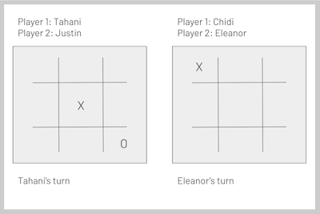

# JavaScript Classes 

## Requisite Knowledge

To understand this article, you will need to understand the following: 

* Basic JavaScript
* Objects
* Functions
* The `this` keyword
* The `new` keyword

Let's briefly look at the last four. 

### Objects

JavaScript objects are a way to store related key/value pairs together. 

```js
const veganCookieRecipe = {
  ingredientList: ['flour', 'margarine', 'dark chocolate', 'sugar', 'baking poder', 'coconut milk'],
  cookTemp: 375,
  cookTime: '10 min'
}
```

### Functions 

Functions are a way to run the same set of actions over and over with varying inputs and return the resulting output.

```js
function divide(num1, num2){
  return num1 / num2;
}
```

### The `this` keyword

`this` is a JavaScript keyword. When used in a function `this` refers to the object that "owns" that function execution. The value of `this` is determined by the call-site. 

When called like this: `foo()` the value of `this` inside foo will be the global object (or undefined in strict mode)

When called like this: `user.foo()` the value of `this` inside foo will be the user object or when called like this: `panda.foo()` the value of `this` inside foo will be the panda object.

When called like this: `new foo()` the value of `this` inside foo will be a new object created inside the foo function. 

### The `new` keyword

The `new` keyword is used to call functions. Any function can be called with `new`. The `new` keyword does two special things inside the function:

1. Creates an empty object named `this`
2. Returns the `this` object

_Note:_ You don't need to use the `return` keyword to return `this` from  function called with the `new` keyword.

Example: 

```js

const Frog = function (frogName){
  this.name = frogName;
  this.sound = 'ribbit';
}

const frog1 = new Frog('Roger');
```

The resulting `frog1` object looks like: 

```js
const frog1 = {
  name: 'Roger',
  sound: 'ribbit'
}
```

Alright, let's get into the good stuff... _class_ time!

---

## The Multiple Object Problem

### Multiple Objects

We often find ourselves needing to create similar objects over and over and over. 

Imagine you are creating an online game. Multiple games can run at once. Each game needs its own object to keep track of its players and whose turn it is.



Take a look at the code below: 

```js
const game1 = {
  player1: 'Tahani',
  player2: 'Justin',
  currentPlayer: '',
  start: function(){
    this.currentPlayer = this.player1;
  }
}

const game2 = {
  player1: 'Eleanor',
  player2: 'Chidi',
  currentPlayer: '',
  start: function(){
    this.currentPlayer = this.player1;
  }
}
```

There you have it 2 nearly identical game objects with different values. So what's the problem? 

The problem is that we have to write the same code over and over and over. 

And what if the rules of the game change? Suppose the game now starts with player2... We have to go and change _both_ start functions. 

You may be saying 'Well that's not so bad. It's just 2 start functions'... Sure. But imagine we had 100 games running. Or 1000!

---

## The Class Solution

So we know the problem, but how do we solve it? Enter the `class` keyword!

Think of `class` as a JavaScript keyword that basically makes an object factory. Like a car factory cranks out cars, we can use `class` to crank out multiple similar objects with ease! Let's look at our game example using `class`:

```js
class Game {
  constructor(player1Name, player2Name){
    this.player1 = player1Name;
    this.player2 = player2Name;
    this.currentPlayer = ''
  }

  start(){
    this.currentPlayer = this.player1;
  }
}
```
Let's break this down piece by piece:

A class is just a function that you are forced to call with the `new` keyword:

```js
class Game {}
const game1 = new Game();
```

The above code is essentially just like writing:

```js
const Game = function (){}
const game1 = new Game();
```

The `constructor` is a function inside the class that build your new object. You pass in the arguments, assign them using the `this` keyword, and it spits out the new object:

```js
class Game {
  constructor(player1Name, player2Name){
    this.player1 = player1Name;
    this.player2 = player2Name;
    this.currentPlayer = ''
  }
}

const game1 = new Game('Tahani', 'Justin');
```

Remember the `constructor` function builds our new object. `constructor` is a keyword and every class should have a constructor function.

So what does our object look like now? 


```js
const game1 = {
  player1: 'Tahani',
  player2: 'Justin',
  currentPlayer: ''
}
```

Hey look! It's almost identical to the object we started with in the Multiple Object section. We're almost done!

The only problem is we can't start the game. There's no `start` function. Let's add it. 

```js
class Game {
  constructor(player1Name, player2Name){
    this.player1 = player1Name;
    this.player2 = player2Name;
    this.currentPlayer = ''
  }

  start(){
    this.currentPlayer = this.player1;
  }
}
```

Now we create our game objects from the class:

```js
const game1 = new Game('Tahani', 'Justin');
const game2 = new Game('Chidi', 'Eleanor');
```

That's it! We're done! We've created 2 game objects, but imagine how easily we could create 100. 

```js
const game3 = new Game('Janet', 'Michael');
```

There's one!

```js
const game4 = new Game('Real Elenor', 'Trevor');
```

There's another! It's so easy!

Really? We're done? That's it? ... Well yes and no. The code is complete, but there's more boring explanation to read. 

So what's the `game1` object look like now?

```js
const game1 = {
  player1: 'Tahani',
  player2: 'Justin',
  currentPlayer: ''
}
```

Oh crap. It looks the same as before we added `start` to our Game class. So where's the start function. 

This is the best part about classes. Notice that the start function looks identical in every single object. So storing it over and over doesn't make sense. It's just wasting memory. 

In a class, only things inside the constructor get added to the new object created from that class. So in our Game example,  `player1` ,`player2`, and `currentPlayer` all get added to each object. But things created in the class _outside_ the constructor get added just once in a centralized place that every object created from the class has access to. So in our Game example, the `start` function is just created one time rather than on each object and every game object has access to it. 

So how do we call `start` if it's not on the object? Call it just like normal. 

```js
const game4 = new Game('Real Elenor', 'Trevor');
game4.start();
```

See? We call it like it's on the `game4` object. 

---

## The Summary

We often need to create multiple objects that are very similar but have differing values for some or all of their properties. 

The `class` keyword makes this ease. 

Classes are special function with 3 important features:

1. They can only be called with the `new` keyword so they always return a new object.
2. They have a function called `constructor` that builds the new objects. 
3. Anything declared outside the constructor function, is created in a secret centralized area that every object created from the class has access to. 